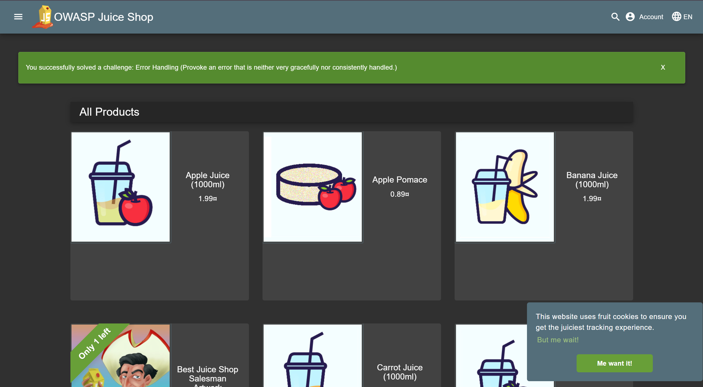
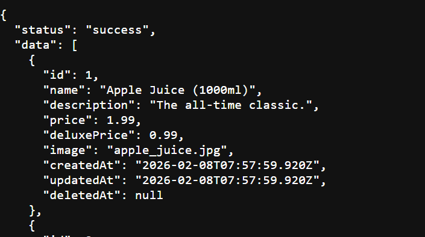
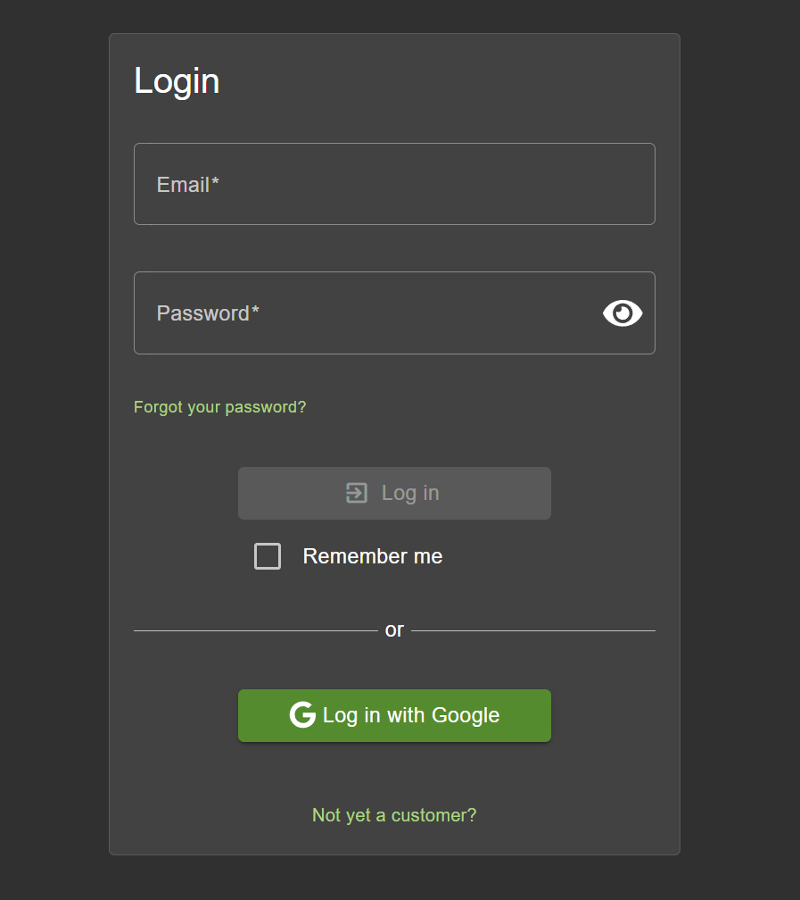
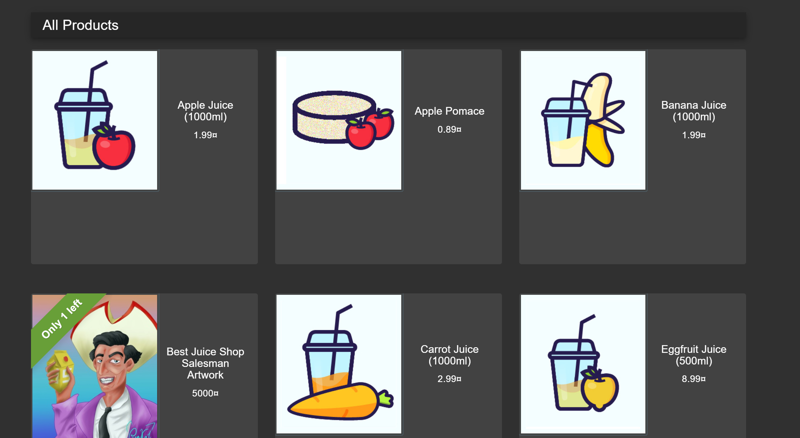
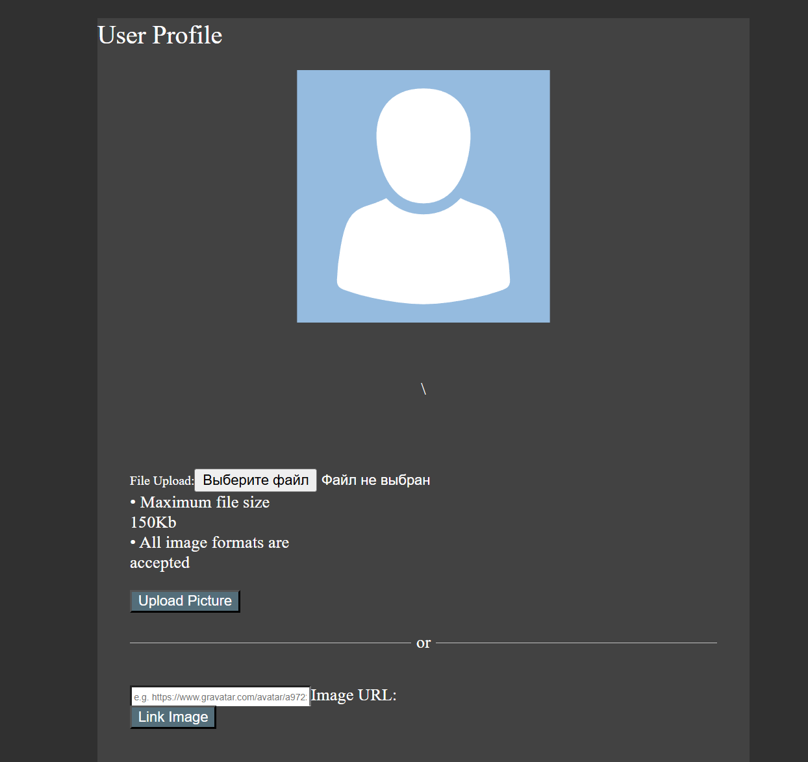
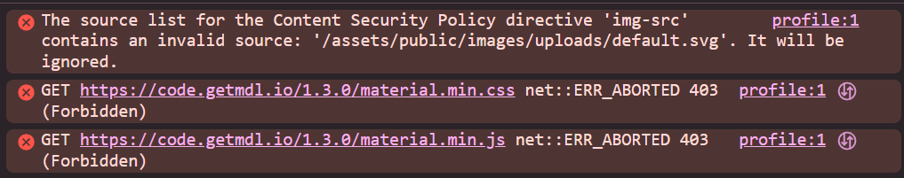
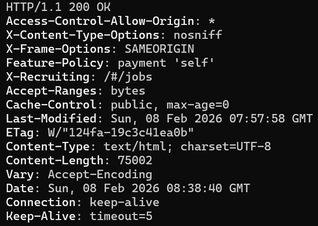

# Triage Report — OWASP Juice Shop

## Scope & Asset
- Asset: OWASP Juice Shop (local lab instance)
- Image: bkimminich/juice-shop:v19.0.0
- Release link: https://hub.docker.com/r/bkimminich/juice-shop
- Image digest (optional): sha256:37cc73163c4c269c044e890fee868d62637109cad126a26dab13dc442ef2ae76

## Environment
- Host OS: Ubuntu 24.04
- Docker: 28.3.3

## Deployment Details
- Run command used: `docker run -d --name juice-shop -p 127.0.0.1:3000:3000 bkimminich/juice-shop:v19.0.0`
- Access URL: http://127.0.0.1:3000
- Network exposure: 127.0.0.1 only [x] Yes  [ ] No  (explain if No)

## Health Check
- Page load:

- API check: first 5–10 lines from `curl -s http://127.0.0.1:3000/rest/products | head`\
This path is wrong. I checked API and found path for products: `/api/products`./

## Surface Snapshot (Triage)
- Login/Registration visible: [x] Yes  [ ] No

- Product listing/search present: [x] Yes  [ ] No

- Admin or account area discoverable: [X] Yes  [ ] No

- Client-side errors in console: [X] Yes  [ ] No

- Security headers (quick look — optional): `curl -I http://127.0.0.1:3000` → CSP/HSTS present?

## Risks Observed (Top 3)
1) Injection (login as an admin)
2) DOM XSS (weakness in search panel)
3) Miscellaneous (privacy policy works without confirmation)

6. GitHub Community
Starring repositories in open source helps acknowledge maintainers' work, increases project visibility, and encourages continued development by signaling community interest. It also helps developers bookmark useful projects for future reference.

Following developers on GitHub makes it easier to track their work, learn from their coding practices, and stay updated on technologies relevant to team projects and professional growth.